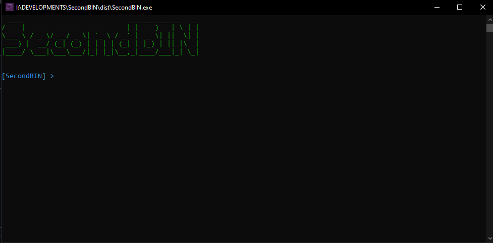

# Showcase

 
# Installation
 Open your browser and go to the github

Next you want to go to latest release: V1.1-RELEASE is latest for me

then go to your downloads folder

make sure you have this setup file

Next extract it

Open the folder

Admin required

and now im not going to yap

then,

